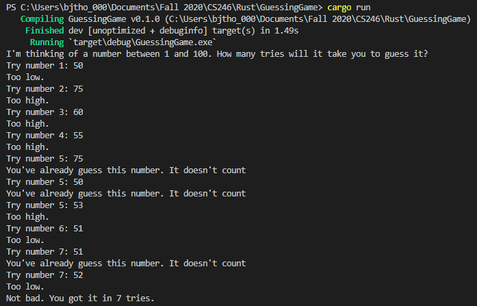

# Overview
This program is, as the title suggests, a simple Guessing Game. The computer will pick a random number between 1 and 100 and you've got to guess what it picked. By the way, I programmed the random number generator myself ;)

The point of this program was to introduce myself to Rust's method of user input, but then I found out that you have to go and download the Rand library to just to generate random numbers. I decieded I'd just go ahead and figure out how to do one myself. Using the system time in microseconds and a little bit of math, I succeeded and made this fun little guessing game.

---
# Environment Setup
## Rust
---
This is programmed in the Rust Programming Language. You can learn more about it at [rust-lang.org](https://www.rust-lang.org/)
## Compiler Setup
---
I set my project up with Cargo. Cargo is a terminal Rust project manager that comes with rust. It automates the entire process of setting up a workspace, setting up a git repository in said workspace, linting your rust code, building complex programs, and even downloading library dependancies. You can download the rust compiler with cargo by following the install instructions on the [Rust language website](https://www.rust-lang.org/tools/install), and get started in Chapter 1 of the [Rust Programming Language Book](https://doc.rust-lang.org/book/ch01-00-getting-started.html).

Setting up a new project with Cargo is easy. Simply navigate in your terminal to the folder you wish to create your project and type the following command:
>cargo new [insert your project name]

This will make a new project directory with a "Cargo.toml" file, a "src" folder, and a git repository with .gitignore already inside to ignore the build files. All that's left to do is open the "Cargo.toml" file and make sure the info there is correct, otherwise make it correct. That's it!

## Dependencies 
---
There are no dependencies for this program!
## Visual Studio Code
---
I used VS Code as an IDE for this program. It integrates fully with Cargo via the extension Rust by The Rust Programming Language. It's really easy to install and set up. 
- Simply go to https://code.visualstudio.com/ to download and run the VS Code installer for your system
- Once you've installed and opened VS Code on your computer, on the left side of the screen you should see some icons. Click the one that says "Extensions" when you hover over it. It should look like a box or boxes.
- Search extensions for Rust by The Rust Programming Language and install that one by clicking the green "Install" button.
- Once that's done, you'll need to reload your window by clicking on the blue "Reload" button on the extension.
- VS Code is now ready for Rust!
---
# The Program in Action

---
# Useful Sites
- [Tutorials Point: Rust](https://www.tutorialspoint.com/rust/)

## Library Docs
- [Rust Standard Library Docs](https://doc.rust-lang.org/std/)
- [Time Library Docs](https://doc.rust-lang.org/std/time/index.html)
