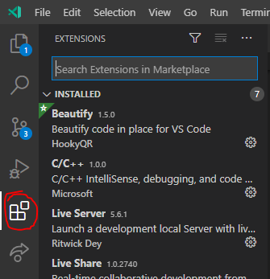
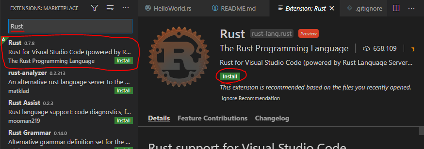
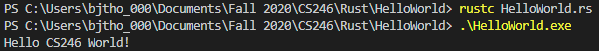

# Overview
This program is a basic Hello World program written in Rust. The purpose is for me to learn the basics of syntax and terminal output in Rust. 
# Environment Setup
## The Rust Language
I used Rust to program this simple hello world program. There are a number of useful websites to learn the language, which will be listed at the bottom of this file under "Useful Sites." I recomend "Tutorials Point" and "Rust by Example."
## The Rust Compiler
Follow the install instructions on the [Rust language website](https://www.rust-lang.org/tools/install) for you're operating system. If you do not know wheather you're running a 32-bit or a 64-bit system, follow the instructions below to find out. Another great instruction recource is [Tutorials Point](https://www.tutorialspoint.com/rust/rust_environment_setup.htm). This gives a detailed walkthrough on setting up the Rust commandline environment.
### Windows
---
Launch the windows settings app and navigate to System -> About. "Device Specifications" should tell you what system type you're running.

### Linux and MacOS
---
Typing the following command into the terminal should return a number representing you're system's bit depth: 
> getconf LONG_BIT

## The IDE
I've used Visual Studio Code for many projects and it has always been a favorite of mine. 
### Installing VS Code
---
- To get started with VS Code, go to https://code.visualstudio.com/ and click the download link for your system, it should be automaticly detected.
- Run the installer and follow the instructions given. The default settings should work fine.
- Once the installer is finished, you're good to go! Now open the IDE.
### Getting Extensions
---
VS Code is incredibly versitle with the ability to download new extensions to work with any language or add new capabilities to your environment. I'll go ahead and recommend some extensions for working with Rust.
- To get started installing extensions, click on the extensions icon on the left side of the screen.

- I recommend getting "Beautify" by HookyQR, and "Rust" by The Rust Programming Language
- Once you click on an extension, it will take you to the extension's page where there should be a green "Install" button. Click it. (You can also click the install in the side window too)

- When the extension has installed, you'll need to reload the window for it to have any effect. VS Code will notify you of this under the extensions section. Simply clear the extension search bar and you should see a blue "reload" button next to your new extension. Click it and the window will reload. Another way to reload the window is to use the command pallette (ctrl + shift + P) and type "reload". Click "Developer: Reload Window"

# Compiling with Rust
When you have a program you would like to compile, first make sure the file is in it's own folder and that it is saved with the ".rs" extension. You may now open a terminal or command window and navigate to that folder. All that is left to do is to run the following command:
> rustc [name of file]

For example:
> rustc HelloWorld.rs

The output should consist of a ".exe" file and a ".pdb" file. Run the ".exe" file.

# Hello World in Action!

# Useful sites
- [Rust Reference](https://doc.rust-lang.org/reference/index.html)
## Learning Rust
- [Tutorials Point](https://www.tutorialspoint.com/rust/index.htm)
- [Rust by Example](https://doc.rust-lang.org/stable/rust-by-example/)
- [Rust Website](https://www.rust-lang.org/learn)
## Trouble shooting
- [Google](https://www.google.com)
